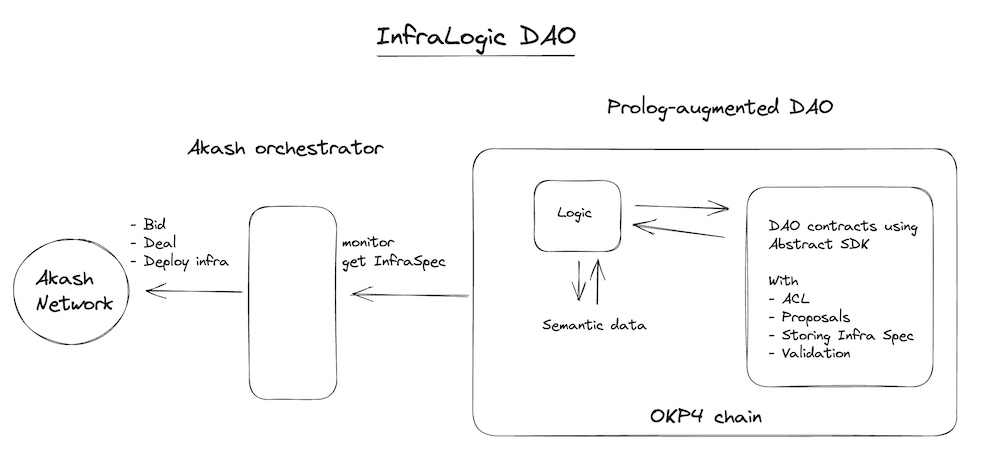

## InfraLogic DAO (hackmos 2023)

Decentralized org using logic to decide who can pitch project ideas, and then sets up the tech needed for those ideas.

## Our goals

DAO for collective decentralized infrastructure deployments, with access control derived from  rules leveraging semantic data. The DAO would give proposal permissions to members, based on Prolog rules asserting properties of semantic data. Proposals deploys infrastructure (SDL stored in Objectarium) on Akash.

We wanted to use and learn CosmWasm, Abstract SDK, OKP4, Prolog, Rust, Akash as we were working on this.

… Turns out that was overly ambitious for 24h. We learned a lot, but and also learned to fail constructively.

## What we worked on

- Run OKP4 local node with Abstract SDK
- Building DAO smart contract
- Integrating OKP4 smart contracts with Abstract SDK
- Calling the (custom) OKP4 Logic module from Abstract SDK
- Blockchain event watcher
- Deployment on Akash

## What was challenging

- While integrating the OKP4 smart contracts with the Abstract SDK, we needed to fork the OKP4 smart contracts. We found a mismatch between the pattern required by Abstract and what was provided by OKP4.
- To call the OKP4 Logic module from Abstract SDK, we had to fork upon a *draft* PR (https://github.com/AbstractSDK/abstract/pull/41/files) of the Abstract SDK to leverage Stargate messaging with the module’s protobufs. We didn’t complete in time.
- Setup up for development (run local nodes, deploy and interact with smart contract). The most time consuming was setting up local node and deploying smart contracts using Abstract.
- The Akash deployment from a given SDL file is well documented. It’s user friendly if we config+deploy+bid manually from UI or CLI. But it takes a lot of time to automate and pipeline such procedure and integrate into our project.
- We wanted a decentralized solution, but Akash required an off-chain deal maker.
- Overall we were challenged with the onboarding into CosmWasm, Abstract SDK, OKP4, and some aspects of Rust (e.g. traits, conditional features, etc).

## Takeaways and suggestions

Abstract SDK DevEx

- Suggestion: more documentation needed for when integrating `cw-orch` with ‘non-standard’ contracts
- Suggestion: full tutorial for App creation

OKP4 DevEx

- Suggestion: consider making testnet permissionless
- Suggestion: consider provide a CosmWasm starter template that deploys all required contracts on [local] node

Akash

- Suggestion: enable decentralization via smart contracts (e.g. using IBC), such that we can have the orchestrator on-chain

CosmWasm

- Suggestion: Provide a Remix-like web editor to deploy easily
    - Having to install Rust, Go, local nodes, relayers, etc is a lot.
    - Remix provides examples to do “click and deploy”

Most of our time was onboarding and setting up tools, and learning about the technologies.

We should have targeted a smaller project given our lack of experience in the ecosystem’s tech.

We were surprised at the hackathon duration. We got the info that it was going to be shorter than what we expected a few hours before the submission time.

We learned a lot :)

## Links
- Presentation: https://docs.google.com/presentation/d/1FEw94tVDXwXWf78L0NBdAoB4bLDL-NHJdhjUz1i5xwI
- small Prolog interpreter in Prolog on OKP4 https://github.com/orpheuslummis/meta-lawstone
- Fork of OKP4 smart contracts: https://github.com/orpheuslummis/okp4-contracts/tree/dev
- Fork of Abstract SDK: https://github.com/orpheuslummis/abstract
- Branches with work on setting up and CosmWasm
    - https://github.com/orpheuslummis/hackmos2023/tree/aeither/test1
    - https://github.com/orpheuslummis/hackmos2023/tree/aeither/test2
    - https://github.com/orpheuslummis/hackmos2023/tree/aeither/test3
    - https://github.com/orpheuslummis/hackmos2023/tree/test4